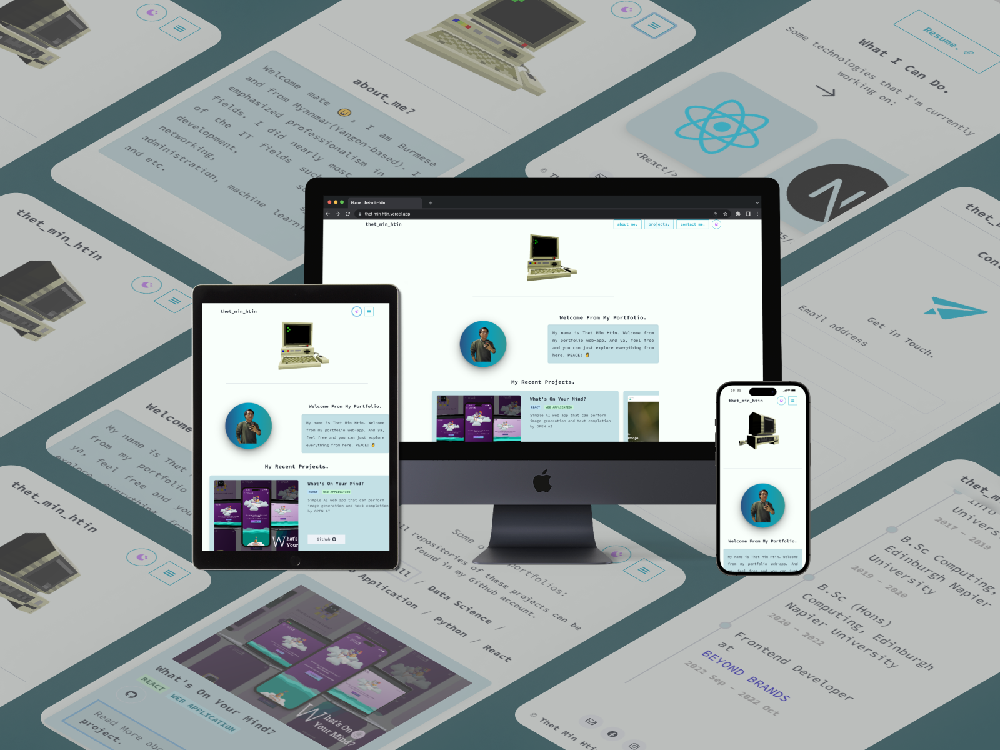
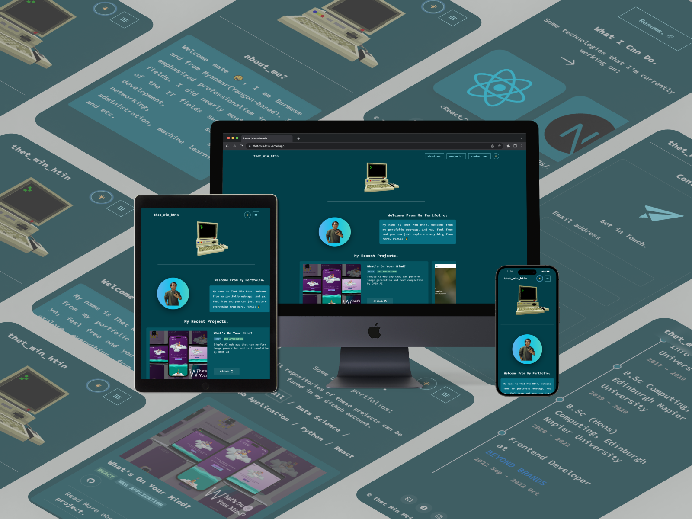

# My Personal Portfolio Website.

This will be my second personal portfolio website which is built with ReactJS. Sanity.io headless CMS is used for backend to store my project information.

## Mockup Images

### Light Mode



### Dark Mode



## Major Technologies

### ReactJS

- ReactJS library is used to build the web app.

### Sanity

- To store my project data, headless CMS [sanity](https://www.sanity.io/) is used.

### ThreeJS

- To used threejs in ReactJS, some libraries is need like [Pmndrs.doc](https://docs.pmnd.rs/)

### React Router DOM v6

- React router dom is used to navigate efficiently through web app.

### Chakra UI

- For styling and components, [ChakraUI](https://chakra-ui.com/) is used.

### Snowing Features

- There will be snow effect on the christmas day.

# Run Locally

Clone the project

```bash
git clone https://github.com/ClockWize171/my_2nd_portfolio
```

Go to the project directory

```bash
  cd <your-repo-name>
```

Install dependencies

```bash
  npm install
```

Start the server

```bash
  npm start
```
